## Data Collection

Data for this project comes from two sources. The primary dataset is a large, regularly updated collection of European soccer data covering player profiles, appearances, and market valuations, downloaded from Kaggle. It provided detailed player-level information - including position, physical attributes, career statistics, and valuation history - spanning tens of thousands of professional players. This was supplemented with data pulled directly from the *football-data.org* API, which provides live standings and match information for major competitions, adding current-season context alongside the historical player data. An additional attribute, player age, was also engineered from each player's date of birth to support later analysis, since age was not directly available as a standalone field in the original data.

The combined dataset required meaningful cleaning before analysis. Player performance statistics were aggregated from individual match appearances into career totals, and the most recent market valuation for each player was identified from a full valuation history. Missing values were handled differently depending on what they represented: players with no recorded match appearances were removed, since no performance analysis was possible for them, while smaller gaps in fields like preferred foot or birth country were filled with an explicit *"Unknown"* label rather than guessed. A data entry error was also identified and corrected, where two players had implausible height values that appeared to be a unit mismatch in the source data. A small number of players (62, under 1% of the dataset) had their position listed as "Missing" in the original source data - this was retained as-is given its negligible size rather than dropped or guessed. After cleaning, the dataset consisted of just over 27,000 players with complete, usable records across all key fields.

## Raw vs Cleaned Data

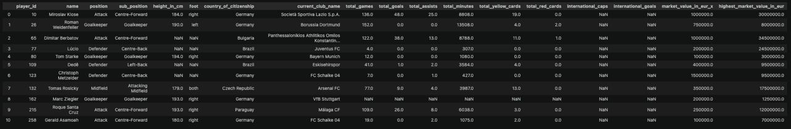

*A sample of the merged player dataset before cleaning, showing missing values and inconsistent column naming from the initial data merge.*

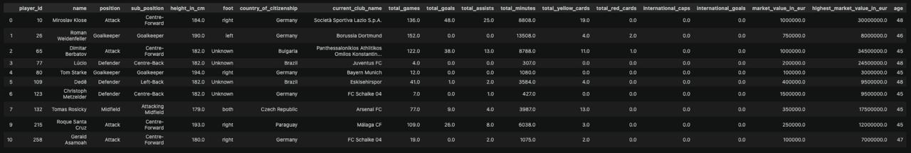

*The same sample after cleaning - missing values resolved, column naming corrected, and data-entry errors fixed.*

## Data Sources

- **Downloaded dataset:** [Football Data from Transfermarkt (Kaggle)](https://www.kaggle.com/datasets/davidcariboo/player-scores)
- **API:** [football-data.org](https://www.football-data.org/) — base URL `https://api.football-data.org/v4`, example call: `GET https://api.football-data.org/v4/competitions/PL/standings`
- **Code:** [GitHub repository](https://github.com/karan-cheemalapati/Soccer-Analytics)

## Exploratory Visualizations

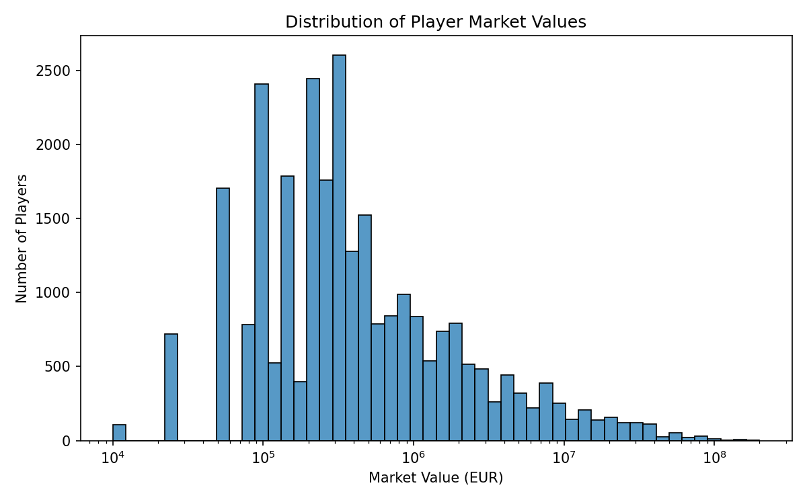

*Player market values are heavily right-skewed, with most players valued under 1 million euros and a long tail of elite players reaching 100 million euros or more.*

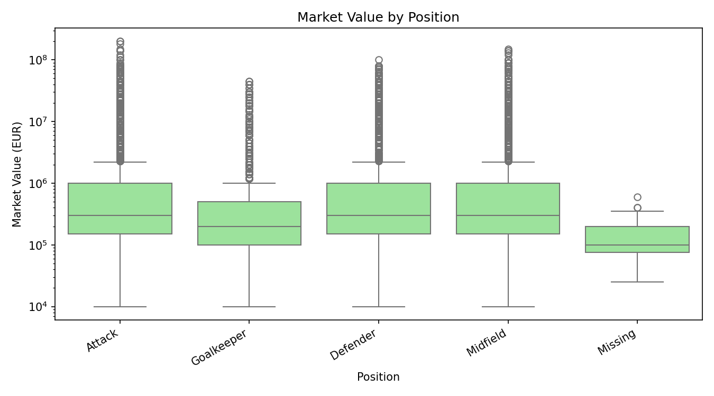

*Median valuations are broadly similar across positions, though attackers and midfielders show a wider spread and higher ceiling among top earners.*

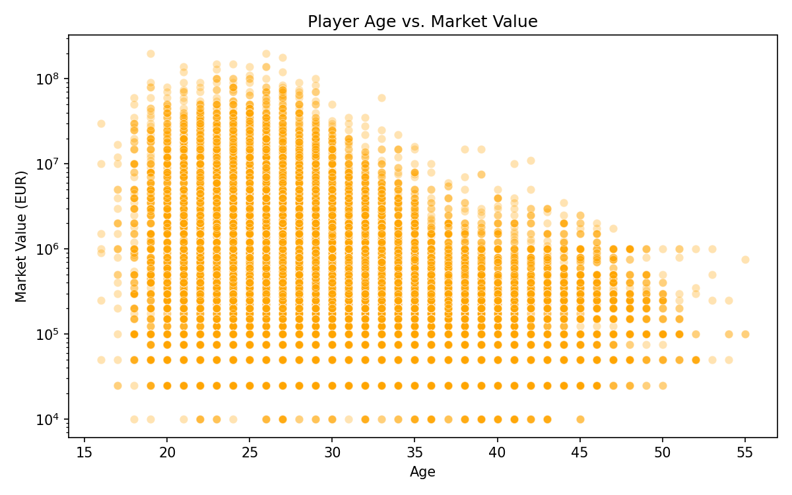

*Market value tends to peak between ages 25 and 27, then gradually declines as players move further into their thirties.*

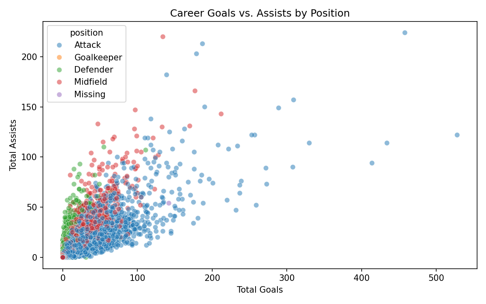

*Attackers cluster toward high goal counts while midfielders and defenders show relatively higher assist contributions for their goal totals.*

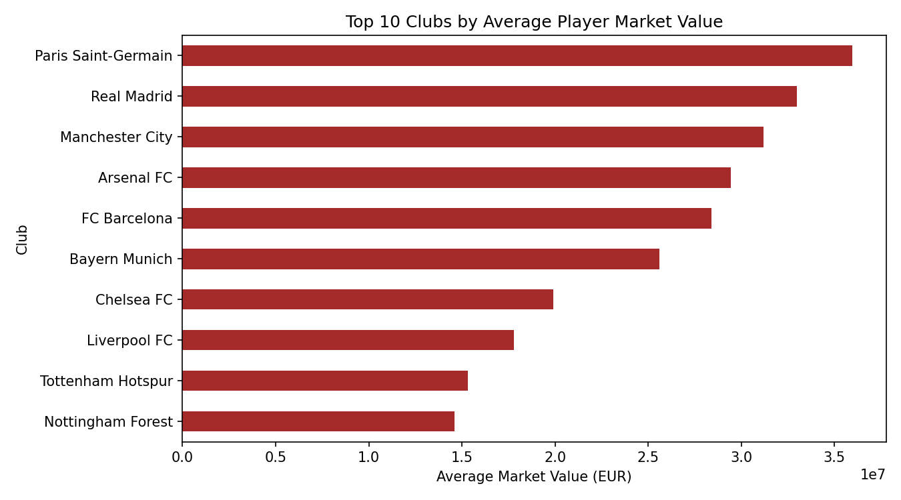

*Paris Saint-Germain, Real Madrid, and Manchester City lead all clubs in average player valuation, reflecting their concentration of high-value talent.*

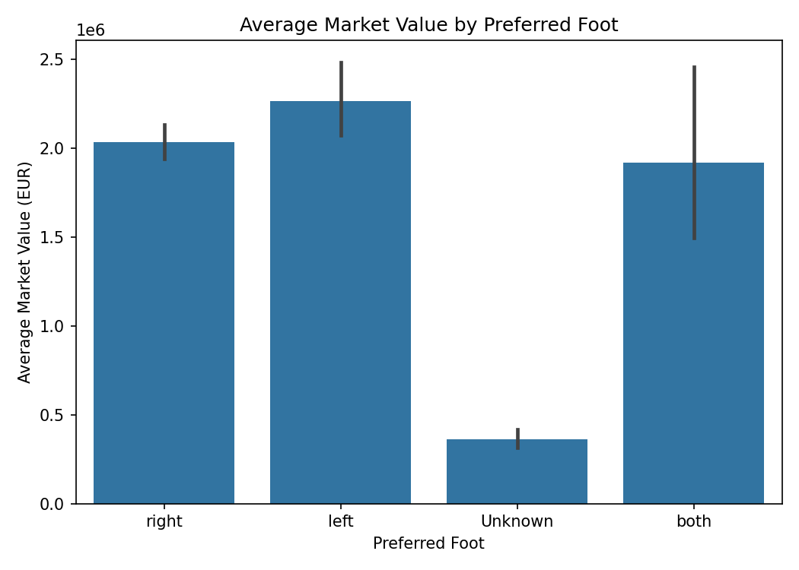

*Left-footed players show a modestly higher average market value than right-footed players, though both fall within overlapping confidence ranges.*

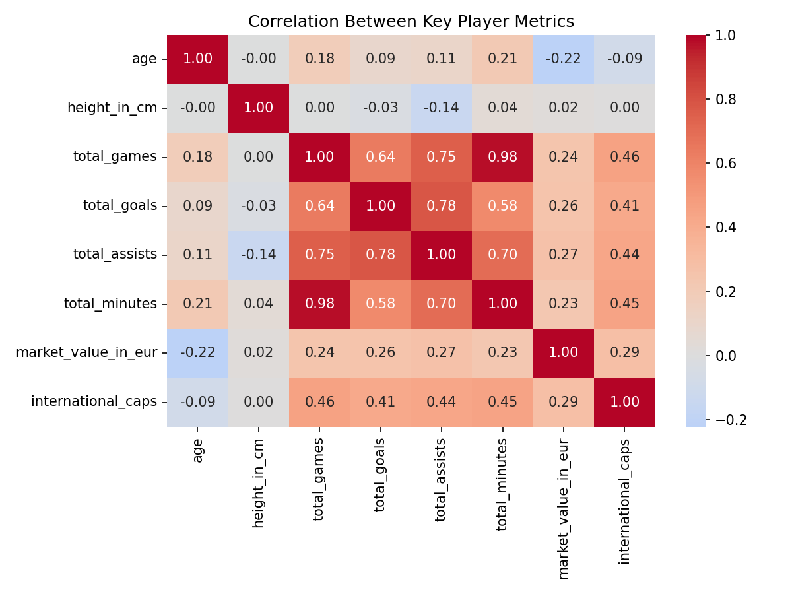

*Market value correlates positively with career games, goals, and international caps, and negatively with age, suggesting younger, more active players tend to carry higher valuations.*

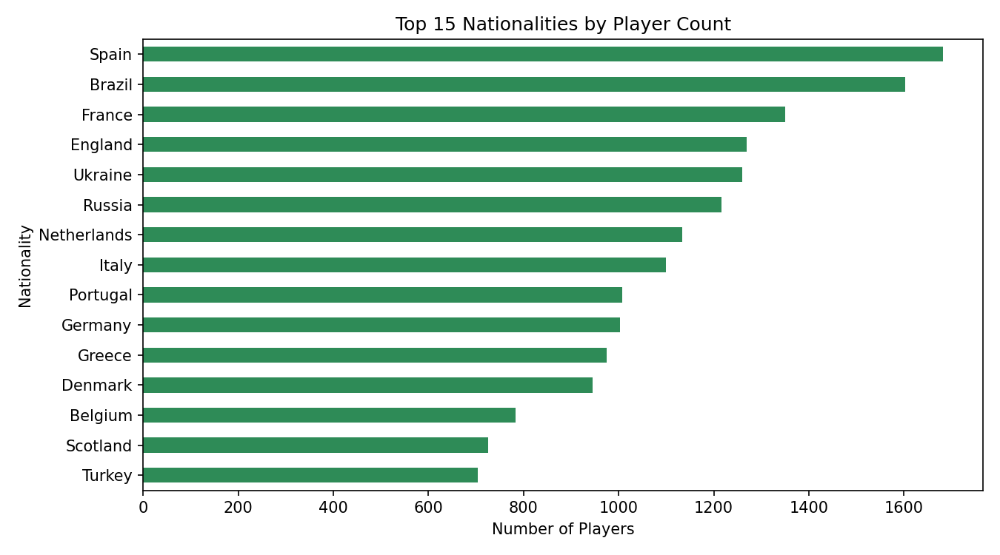

*Spain, Brazil, and France produce the largest number of professional players in this dataset, reflecting the scale and depth of their domestic football pipelines.*

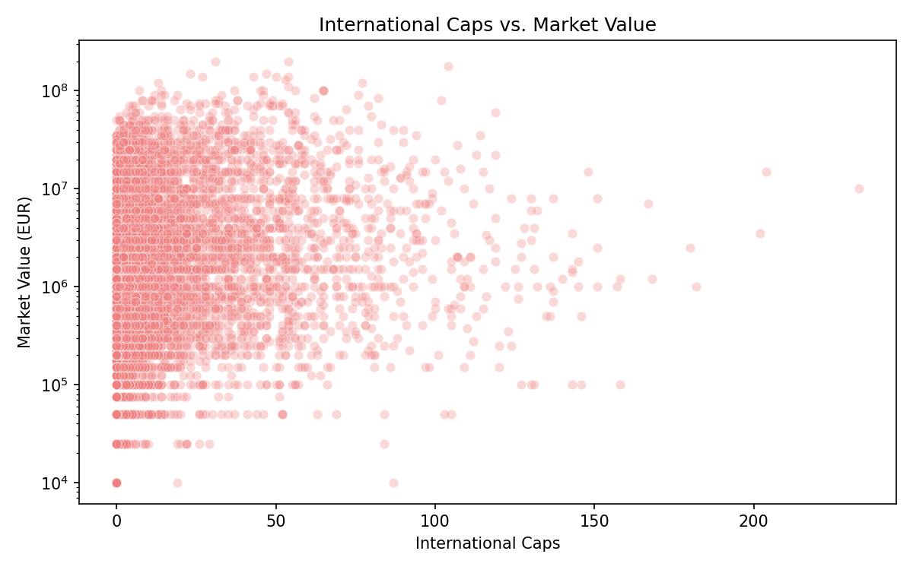

*Players with a high number of international caps tend to carry higher market values, though many high-value players have few or no caps at all.*

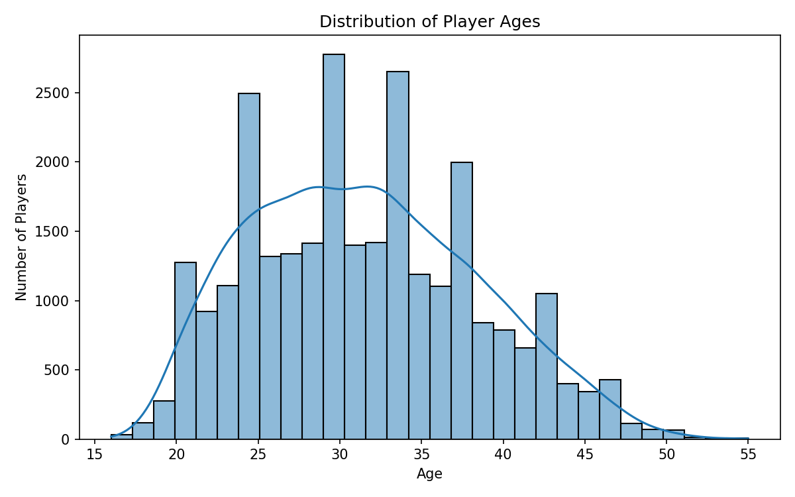

*The player population skews toward players in their mid-to-late twenties, with a sharp drop-off in representation past age 35.*