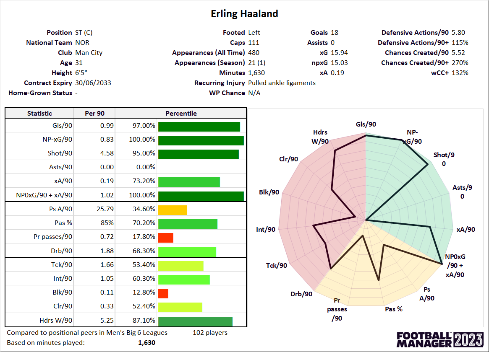

Every summer and winter, football clubs hand over tons and tons of money for players, and the number attached to each transfer rarely feels arbitrary - yet it's remarkably hard to pin down where that number actually comes from. A 22 year-old defender might be valued at 15 million euros while a similarly aged midfielder down the road goes for a fraction of that, and the difference often comes down to a mix of factors that even seasoned football people struggle to fully untangle. For most of the sport's history, this kind of judgment lived entirely in the heads of scouts - people who spent weekends in the stands, watched tape late into the night, and trusted their gut more than any spreadsheet. That's shifted quite a bit over the past decade or so, as clubs have started tracking an enormous amount about their players: how many goals they score, how many minutes they log, how often they get called up to their national team, even how disciplined they are on the pitch. Services that specialize in estimating a player's transfer value have become part of how the football world talks about talent, showing up in newspaper headlines and fan debates just as often as in boardrooms.

The stakes are real for everyone involved - a club that misjudges a signing can set itself back for years, a player's earning power hinges on how the market perceives them, and agents build entire careers around negotiating that gap between perceived and actual worth. Still, valuing a player is nowhere close to a solved problem. Age plays a role, but so does position, physical build, the league a player competes in, and even reputation built up over time - and it's genuinely unclear how much weight each of these should carry, or how they interact with one another. A 20 year-old striker and a 32 year-old goalkeeper aren't judged by the same yardstick, and a player who looks average by the numbers might still be considered invaluable for reasons that never show up in a stat sheet. It's this tangle of overlapping, sometimes contradictory signals that makes player valuation such a genuinely interesting problem to dig into.

## Questions This Project Aims to Explore

1. How does a player's age relate to their market value, and at what age does value typically peak?
2. Do certain playing positions command systematically higher valuations than others?
3. What is the relationship between career goal-scoring output and market value?
4. Does international recognition (caps and goals for a national team) correlate with higher club valuations?
5. Which clubs tend to carry the highest average player valuations, and what might explain the gap between top and bottom clubs?
6. Is there a meaningful difference in valuation between left-footed, right-footed, and two-footed players?
7. How do playing time (minutes) and appearances relate to a player's estimated worth?
8. Which nationalities are most heavily represented among professional players, and does nationality show any relationship with valuation?
9. Do physical attributes like height vary meaningfully by position, and does this in turn relate to value?
10. How closely do disciplinary records (yellow and red cards) relate to a player's role or valuation, if at all?

